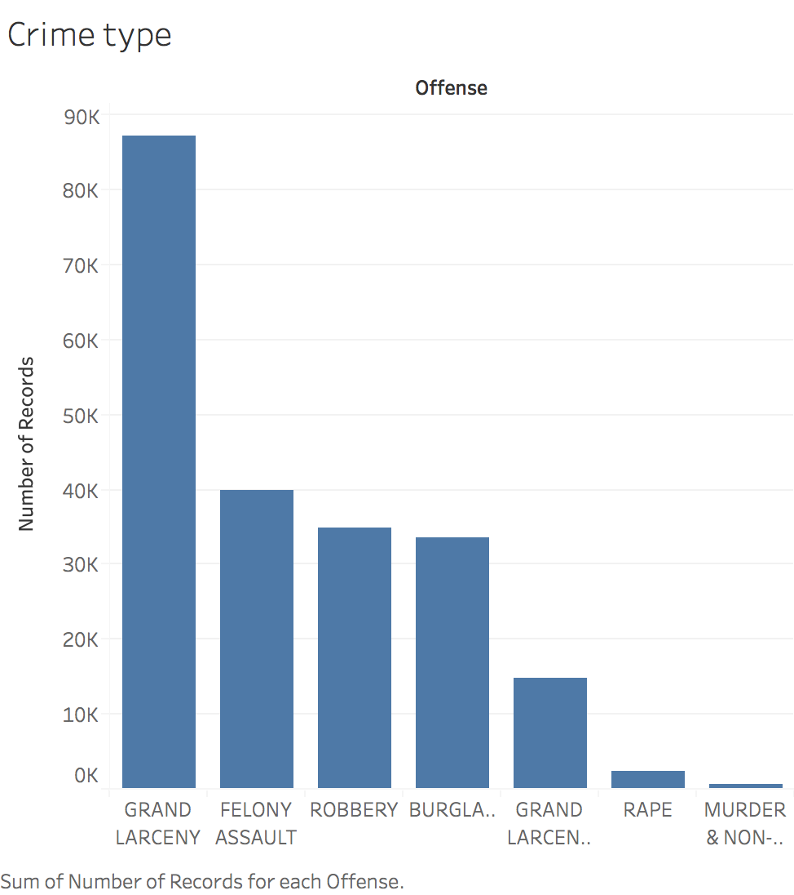
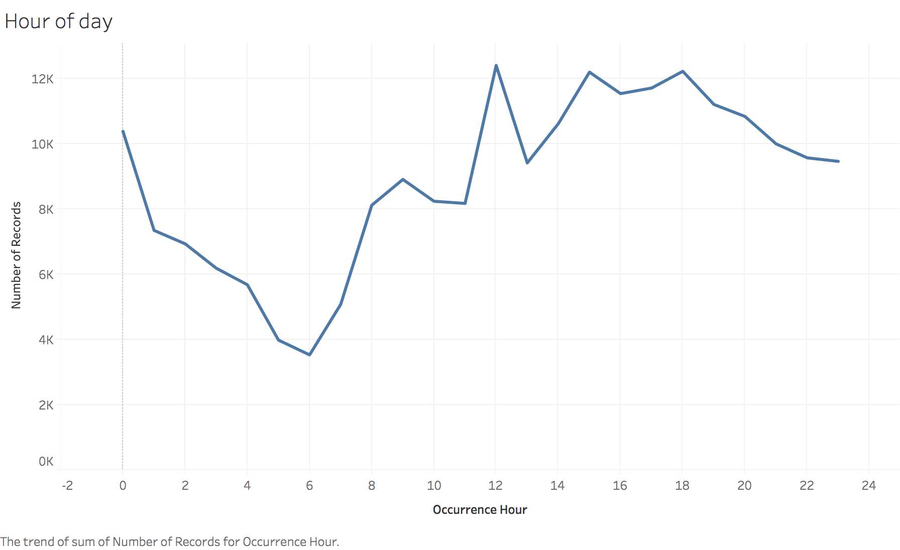
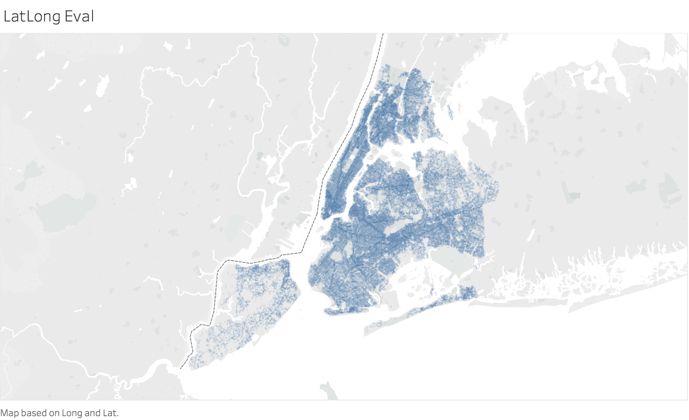

# Kensho Data Challenge Writeup

**tl;dr:** [Kensho](https://www.kensho.com/) provided a 4 hour data scientist data challenge. I built a few models, 
none of which did better than ZeroR. 

## Data observations

### Question 5. If you’ve explored the data, please summarize key observations that you’ve made. As an example, if you’ve determined that there is seasonality in the data, explain what seasonality you’ve found and whether your observation makes sense.

I performed a cursory heuristic and data analysis check with the data set, mostly using Tableau. The data seem to show 
time of day, day of week, and annual seasonality, which all passes my gut check for crime.   

Additionally, I performed cursory analysis for possible predictors / data quality issues. Overall, the data seems to be of 
fairly high quality, with no geo-spatial anomalies, and clear data quality issues. Please see data evaluation plots 
below.

## Model choice

### Questions 3. What approach did you use?
I used a feed forward neural network, trained on a mix of provided variables and minimally engineered features.  

### Question 4. Why did you use this approach?
Given the short time line, new data set with a moderately large number of features, and need for multi-class 
classification, I chose to use a feed forward neural network. While an SVM model with appropriate kernel likely would 
likely have performed well, training multiple one vs many models and choosing kernals would have been time consuming. 
Additionally, Naive Bayes might have performed well and can natively be trained on multi-class classification problems.  

## Metrics

The ZeroR (guessing most common class model) had an accuracy of `.40` on the training set, and `.41` on the test set. 

My model achieved an accuracy of `.42` on a holdout of the training set, and `.21` on the test set, suggesting 
substantial over-fit.  

Though I've built out a decent ETL pipeline and model architecture, it would appear that this has been a failed first 
attempt at modeling this data set.

## Model improvements

### Question 1: How would you improve your model if you had another hour?
Given another hour, I'd add in the incident datetime in epoch (then normalized), and the reported (CompStat) datetime 
in epoch (then normalized). I might then also an explicit difference between the two. My logic is that more serious
crimes would be reported more quickly, or that certain types of crimes would take longer to report. 

### Question 2. How would you improve your model if you had another week?
Given another week, I would likely tie in additional data sets, using the reported date time and location lat long. It 
would be interesting to evaluate neighborhood income, neighborhood daytime population, neighborhood nighttime population, 
and neighborhood walk-ability scores. Additionally, as heat waves have a long studied effect on crime, weather data 
might be valuable as well. Though this is a multi-class classification problem, I'd likely go for a simpler model.   